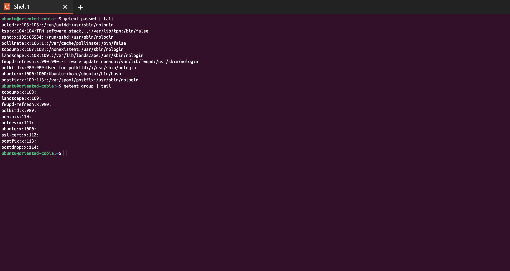

# IAM Bash Automation Scripts

## Overview

This project provides a set of Bash scripts to automate the creation and management of Linux user accounts, groups, and password policies, with logging and email notifications. The scripts are designed for system administrators who need to onboard multiple users efficiently and securely.

## Main Scripts

### 1. `iam_setup.sh`

- Reads user data from `users.txt` (CSV format: `username,fullname,group`).
- Creates groups and users, assigns users to groups, and sets full names.
- Sets a temporary password and enforces a password change on first login.
- Applies a custom password policy for each user.
- Secures home directories (permissions and ownership).
- Sends an email notification for each new user.
- Logs all actions to `iam_setup.log`.

### 2. `iam_setup_csv.sh`

- Enhanced version of `iam_setup.sh` that accepts a CSV file path as an argument.
- If no argument is provided, prompts the user to input the CSV file path interactively.
- Otherwise, follows the same process as `iam_setup.sh`.

## Features

- **Automated User and Group Creation**: Batch process users from a CSV file.
- **Custom Password Policies**: Enforces strong password requirements per user.
- **Home Directory Security**: Ensures only the user can access their home directory.
- **Email Notifications**: Sends a notification to admins for each new user.
- **Comprehensive Logging**: All actions are timestamped in `iam_setup.log`.

## Usage

### Prerequisites

- Run as a user with `sudo` privileges.
- Ensure `libpam-pwquality` is installed (the script installs it if missing).

### 1. Using `iam_setup.sh`

```bash
sudo ./iam_setup.sh
```

- Reads from `users.txt` in the current directory.

### 2. Using `iam_setup_csv.sh`

#### a) With CSV file argument

```bash
sudo ./iam_setup_csv.sh path/to/your_users.csv
```

#### b) With interactive prompt

```bash
sudo ./iam_setup_csv.sh
# (You will be prompted to enter the path to the CSV file)
```

## Screenshots

### Initial State



### Running with CSV Argument


### Running with User Input


### Users and Groups Created


### Email Notification


## File Descriptions

- **iam_setup.sh**: Main script for user/group creation from `users.txt`.
- **iam_setup_csv.sh**: Enhanced script supporting CSV file argument or prompt.
- **users.txt**: Example user data file (CSV format).
- **iam_setup.log**: Log file for all actions performed by the scripts.
- **scripts/pass_policy.sh**: Sets up per-user password policies and enforces password change.
- **scripts/send_mail.sh**: Sends email notifications for new user creation.
- **scripts/revert.sh**: Utility to remove users and groups created (reads from `users.txt`).
- **screenshots/**: Example screenshots of the scripts in action.

## Security Notes

- Passwords are set to a default and must be changed on first login.
- Home directories are locked down to the user only.
- Custom password policies are enforced for each user.
- Email notifications use a test API key (replace for production use).
